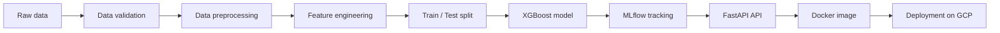
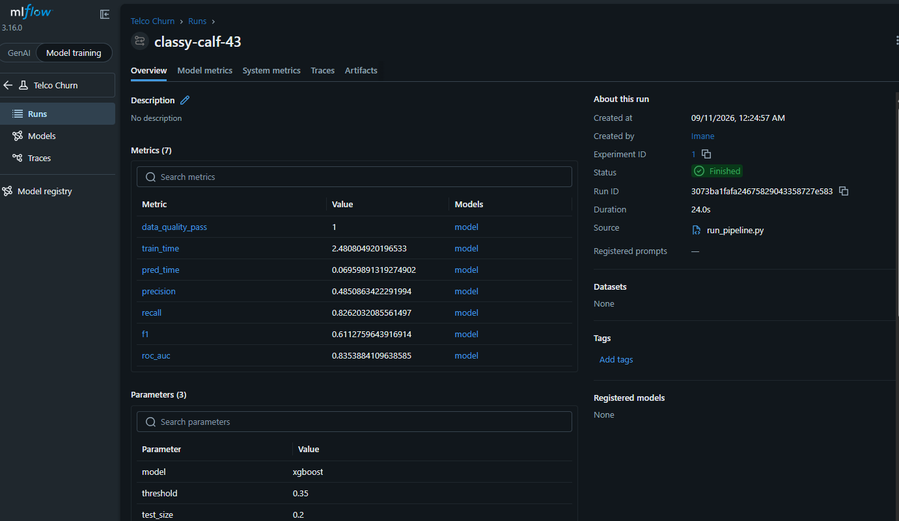
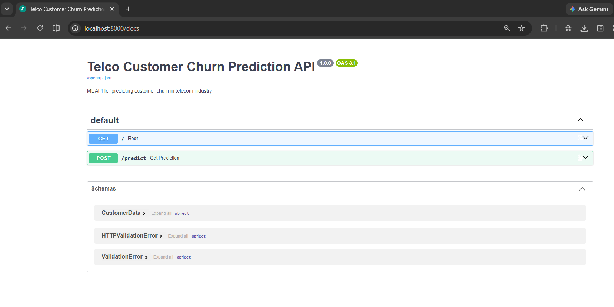
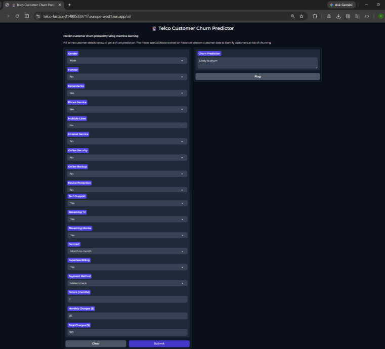

# Telco Customer Churn Prediction

## Overview

Ce projet vise à prédire le risque de churn client dans le secteur télécom en utilisant un pipeline MLOps complet, de l’acquisition des données jusqu’au service de prédiction en production.

L’objectif est d’industrialiser un modèle de machine learning pour identifier les clients susceptibles de quitter le service, afin d’aider les équipes business à mettre en place des actions de fidélisation ciblées.

Le projet couvre les étapes suivantes :
- validation et nettoyage des données
- feature engineering
- entraînement d’un modèle de classification binaire
- tracking des expériences avec MLflow
- exposition d’une API REST avec FastAPI
- conteneurisation avec Docker
- automatisation via GitHub Actions
- déploiement sur Google Cloud Platform

---

## Business problem

Les opérateurs télécom sont confrontés à un enjeu majeur : la perte de clients. Le churn client a un impact direct sur la rentabilité, car l’acquisition d’un nouveau client coûte souvent plus cher que la fidélisation d’un client existant.

Cette solution permet de :
- identifier les clients à risque
- prioriser les campagnes de fidélisation
- mieux comprendre les facteurs qui influencent la décision de départ

---

## Project architecture



---

## Stack technique

- Python
- pandas
- NumPy
- scikit-learn
- XGBoost
- MLflow
- FastAPI
- Uvicorn
- Docker
- GitHub Actions
- Google Cloud Platform
- Gradio
- Great Expectations

---

## Pipeline ML

### 1. Importation des données
Les données sont chargées depuis un dataset CSV contenant les informations clients et la cible churn.

### 2. Validation des données
Avant l’entraînement, le pipeline vérifie la qualité des données avec Great Expectations, notamment :
- présence des colonnes attendues
- cohérence des valeurs
- bornes de variables numériques
- règles métier sur le dataset

### 3. Prétraitement
Les données sont nettoyées et préparées pour l’entraînement :
- conversion de types
- gestion des valeurs manquantes
- suppression des identifiants non utiles
- transformation de la variable cible en format binaire

### 4. Feature engineering
Les variables catégorielles sont transformées pour être compatibles avec le modèle :
- encodage binaire pour les colonnes à 2 valeurs
- one-hot encoding pour les colonnes à plusieurs modalités

### 5. Entraînement du modèle
Le modèle utilisé est XGBoost dans un cadre de classification binaire.

### 6. Évaluation
Le modèle est évalué sur un jeu de test en calculant :
- précision
- rappel
- F1-score
- ROC AUC

### 7. Tracking MLflow
Chaque exécution est enregistrée dans MLflow avec :
- paramètres du modèle
- métriques
- artefacts
- modèle final

### 8. Service de prédiction
Une API FastAPI expose le modèle et permet de faire des prédictions en temps réel à partir de données client.


## MLflow tracking

Le suivi des expériences est assuré par MLflow.

L’outil permet de suivre :
- les paramètres d’entraînement
- les métriques de performance
- les artefacts générés
- les différents runs du projet

Cela rend le projet reproductible et facilitent la comparaison de plusieurs versions du modèle.

---

## API de prédiction

L’API FastAPI permet d’envoyer des données d’un client et d’obtenir un résultat de prédiction.

### Endpoint principal
- POST /predict

### Exemple de payload

```json
{
  "gender": "Female",
  "Partner": "No",
  "Dependents": "No",
  "PhoneService": "Yes",
  "MultipleLines": "No",
  "InternetService": "Fiber optic",
  "OnlineSecurity": "No",
  "OnlineBackup": "No",
  "DeviceProtection": "No",
  "TechSupport": "No",
  "StreamingTV": "Yes",
  "StreamingMovies": "Yes",
  "Contract": "Month-to-month",
  "PaperlessBilling": "Yes",
  "PaymentMethod": "Electronic check",
  "tenure": 1,
  "MonthlyCharges": 85.0,
  "TotalCharges": 85.0
}
```

### Exemple de réponse

```json
{
  "prediction": "Likely to churn"
}
```

---

## Project structure

```text
Projet_MLOPS/
├── app/
│   └── main.py
├── src/
│   ├── data/
│   ├── features/
│   ├── models/
│   ├── serving/
│   └── utils/
├── scripts/
│   └── run_pipeline.py
├── data/
│   ├── raw/
│   └── processed/
├── artifacts/
├── mlruns/
├── notebooks/
├── dockerfile
├── .dockerignore
├── requirements.txt
├── requirements-prod.txt
├── mlflow.db
├── readme.md
└── .github/
    └── workflows/
```

---

## CI/CD and deployment

Le projet intègre un workflow GitHub Actions pour automatiser les étapes de validation du code et la construction de l’image Docker.

### CI/CD workflow
- validation des dépendances
- exécution du pipeline de training
- build de l’image Docker
- préparation du déploiement

### Containerisation
Le projet est conteneurisé avec Docker pour garantir une exécution reproductible et un déploiement simplifié.

### Cloud deployment
Le service est déployé sur Google Cloud Platform et accessible via une URL publique.

Live demo: https://telco-fastapi-214905330717.europe-west1.run.app/ui

---

## Screenshots

### 1. MLflow UI

MLflow dashboard showing the experiment runs, parameters, and evaluation metrics.



### 2. Swagger API

Interactive FastAPI documentation available through the `/docs` endpoint.



### 3. Deployed Application

Live application deployed on Google Cloud Run.



---

## How to run locally

### 1. Installer les dépendances

```bash
pip install -r requirements.txt
```

### 2. Entraîner le modèle

```bash
python scripts/run_pipeline.py --input data/raw/WA_Fn-UseC_-Telco-Customer-Churn.csv
```

### 3. Démarrer l’API

```bash
uvicorn app.main:app --reload
```

### 4. Accéder à l’API

```text
http://127.0.0.1:8000/docs
```

### 5. Ouvrir MLflow

```bash
mlflow ui
```

Puis ouvrir :

```text
http://localhost:5000
```

---

## Docker commands

### Build image

```bash
docker build -t telco-churn-api .
```

### Run container

```bash
docker run --rm -p 8000:8000 telco-churn-api
```

---

## Conclusion

Ce projet illustre une chaîne de production complète en MLOps :
- acquisition de données
- validation de qualité
- transformation des variables
- entraînement d’un modèle de machine learning
- suivi d’expérience avec MLflow
- service d’inférence via API FastAPI
- conteneurisation Docker
- automatisation via GitHub Actions
- déploiement sur environnement cloud

Il s’agit d’un projet réaliste et complet, orienté vers les pratiques de développement et de mise en production de modèles d’intelligence artificielle.

---

## Author

Projet développé dans le cadre d’une démonstration MLOps / machine learning en production.

### Lancer le conteneur

```bash
docker run --rm -p 8000:8000 telco-churn-api
```

---

## 12. Ce que ce projet montre

Ce projet illustre une vraie chaîne de valeur MLOps :
- données brutes → données traitées
- validation qualité
- feature engineering
- modèle de machine learning
- monitoring des performances
- API de prédiction
- conteneurisation

C’est une bonne démonstration d’un projet de data science appliquée au monde réel avec une logique de production.

---

## 13. Captures d’écran à ajouter

### Capture 1 : MLflow UI
Ajoutez ici une capture de l’interface MLflow avec les runs et les métriques.

### Capture 2 : Swagger /docs
Ajoutez ici une capture de la documentation FastAPI et du point d’entrée `/predict`.

### Capture 3 : Résultat du modèle
Ajoutez ici une capture du rapport de classification ou des métriques obtenues.

---

## 14. Conclusion

Ce projet démontre la capacité à concevoir et livrer un système de machine learning complet, de l’entraînement à la mise en production, en mettant l’accent sur la qualité des données, la reproductibilité et le déploiement.

Il correspond à un projet réaliste d’industrialisation de modèles en environnement MLOps.

---

## 15. Auteur

Projet développé dans le cadre d’un portfolio / démonstration MLOps.
